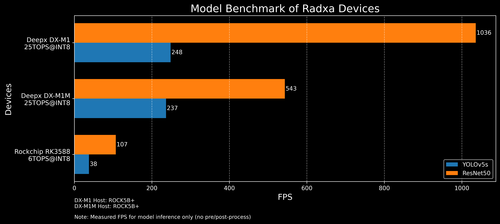

# Radxa NPU Benchmark

This repository aims to create a **long-term updatable NPU benchmark dataset** for Radxa series products. By using the **same models and quantization methods** across multiple platforms, we provide **comparable and reproducible benchmark results** for developers to evaluate NPU inference performance.

## Model Standards

### CNN Models

**ResNet50-v-2-7** and **YOLOv5s**, as benchmark models. The quantization method is **INT8**.

* [ResNet50-v2-7.onnx](https://github.com/onnx/models/blob/main/validated/vision/classification/resnet/model/resnet50-v2-7.onnx)
* [YOLOv5su](https://docs.ultralytics.com/models/yolov5/)

For YOLOv5s, because of its post-processing nodes, quantization on most platform SDKs may cause accuracy issues. Here, we **remove the post-processing nodes before model compilation**, and handle post-processing on the **CPU** in the program. For model modification, please refer to [export/export_yolov5s.py](./export/export_yolov5s.py).

#### Model Export

```bash
cd export
python3 export_yolov5s.py
python3 export_resnet50.py
```

### LLM / VLM Models

* [Qwen2.5-[0.5B / 3B / 7B]-Instruct](https://huggingface.co/collections/Qwen/qwen25)
* [Qwen2.5-VL-[3B / 7B]-Instruct](https://huggingface.co/collections/Qwen/qwen25-vl)

## Benchmark Data

### Model Info

| Model          | Input Shape | Quantization |
| -------------- | ----------- | ------------ |
| ResNet50-v-2-7 | 1×3×224×224 | INT8         |
| YOLOv5s        | 1×3×640×640 | INT8         |

### Performance (FPS)

| Device  | SoC    | DDR Type        | ResNet50-v-2-7 | YOLOv5s |
|---------|--------|-----------------|----------------|---------|
| DX-M1   | DX-M1  | LPDDR5 5600 MHz | 1035.92        | 248.39  |
| DX-M1M  | DX-M1M | LPDDR4 3200 MHz | 543.08         | 236.51  |
| Rock5B+ | RK3588 | LPDDR4 2400 MHz | 106.864        | 37.584  |
| AX-M1   | AX-M1  | Unknow          | 578            | 303     |


### Bar chart



### INFO

All data was collected in performance mode. Please refer to [scripts](./scripts) for setting performance mode.

The accelerator card's host device is ROCK5B+.


